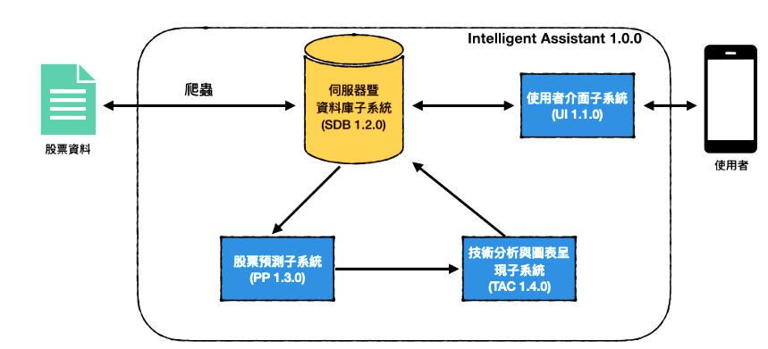
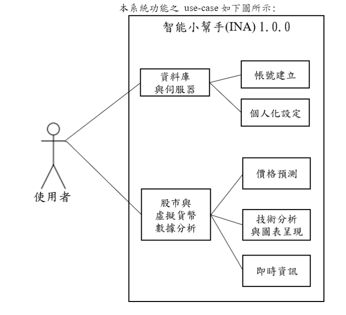

# Intelligent-assistant

## Function
- Predict the trends of Taiwan stock and cryptocurrency
- Each user can have his/her own favorite items

## Framework
- API : FastAPI
- Database : SQLite 
- Server : uvicorn
- Language : Python, JavaScript

## System Architecture

## Use case
